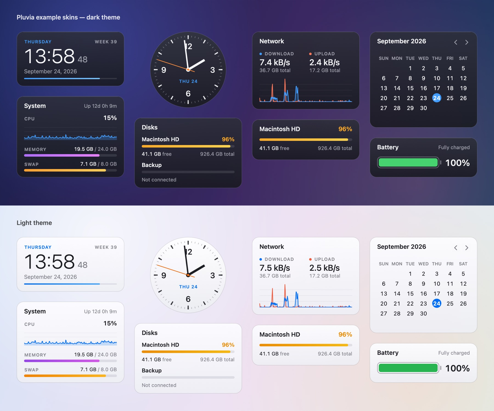

# Deskset

**Native desktop widgets for macOS — and it runs Rainmeter skins.**

[](https://github.com/jokyme/Deskset/actions/workflows/ci.yml)
[](https://github.com/jokyme/Deskset/releases)
[](LICENSE)


[中文说明](README.zh-CN.md)



Deskset puts live widgets on your Mac's desktop: clocks, calendars, system monitors, network and disk meters, audio
visualizers, now-playing panels and more. Use the example skins, build your own in the Skin Studio, or install skins
made for [Rainmeter](https://www.rainmeter.net) — the large library of `.ini` / `.rmskin` skins from the Windows
world — and run them on the Mac.

## Why "Deskset"

A *desk set* is the matched set of things on a writer's desk: a clock, a calendar, a pen stand, an inkwell. Small
objects you glance at while you work. Deskset brings that set to your Mac's desktop.

## Features

- **Runs Rainmeter skins.** `@Include`, variables, formulas, section variables, MeterStyles, bangs and mouse actions;
  every meter (String with inline styles, Image, Bar, Line, Histogram, Roundline, Rotator, Shape, Button, Bitmap);
  the measures (CPU, memory, network, disk, time, uptime, battery, Calc, WebParser…); Lua scripts; and Rainmeter's
  bundled plugins rewritten natively for macOS (AudioLevel, NowPlaying for Music and Spotify, WiFiStatus, InputText…).
  Double-click a `.rmskin` to install it.
- **Native and light.** Swift and AppKit, drawn with Core Graphics and Core Text — no web views. Each skin is a
  transparent panel on the desktop, on the desktop level, with normal windows or always on top; click-through,
  snapping, fading and saved positions included.
- **Skin Studio.** A visual editor with a canvas, layers, a component library, a property inspector and a code editor
  side by side. Edits are written back into the skin's own files, keeping their formatting.
- **Honest compatibility.** Every place where a skin behaves differently than on Windows is documented in
  [docs/COMPATIBILITY.md](docs/COMPATIBILITY.md). Tested against 390 real skins: no crashes, and 6 skins left with
  compatibility notes (all use Windows-only plugin DLLs).

## Requirements

- macOS 13 Ventura or later.
- Apple silicon or Intel — there is a separate download for each.
- Some skins ask for permissions: audio visualizers need System Audio Recording (macOS 14.2+; Screen Recording on
  13–14.1), now-playing skins need to control Music or Spotify, Wi-Fi skins need Location Services to read network
  names. macOS asks only when a loaded skin uses the feature.

## Install

1. Download the latest release from the [Releases](../../releases) page:
   - `Deskset-<version>-arm64.dmg` for Macs with Apple silicon (M1 and later),
   - `Deskset-<version>-x86_64.dmg` for Intel Macs.
2. Open the disk image and drag **Deskset** to **Applications**.
3. Deskset is not notarized by Apple yet, so the first time you open it macOS says it cannot check it for malicious
   software. Open **System Settings → Privacy & Security**, scroll down and click **Open Anyway**. (Or run
   `xattr -dr com.apple.quarantine /Applications/Deskset.app` in Terminal.)

Deskset lives in the menu bar and has no Dock icon. If the menu bar icon is hidden (macOS lets you hide menu bar
items), open Deskset again from Applications to show the **Manage Skins** window.

## Using skins

- **Install:** double-click a `.rmskin` file, or use **Install Skin…** in the menu. Plain `.zip` archives and skin
  folders can be opened with Deskset too (Open With).
- **Manage:** **Manage Skins…** (⇧⌘,) lists every skin; load, unload, and change position, level and transparency.
- **Edit:** right-click a skin → **Edit Skin…** opens it in the Skin Studio. If you prefer your own code editor, choose
  it in **Settings… ▸ Editor**; the menu then also has **Edit in** that app. The files live in
  `~/Library/Application Support/Deskset/Skins` (**Open Skins Folder** in the menu).
- **Compatibility:** right-click a skin → **Compatibility Notes** lists what does not work as on Windows.

Skins are programs: they can run Lua scripts, fetch web pages and run commands. Only install skins from sources you
trust (see [SECURITY.md](SECURITY.md)).

## Limitations

- Windows-only plugins (DLLs) and Windows programs that a skin launches cannot run on the Mac. The skin still loads,
  and its Compatibility Notes list what is missing.
- Hardware sensors (temperatures, fan speeds) are not available yet.
- Windows fonts are replaced by similar Mac fonts, so text can be a little wider or narrower.
- Deskset is not notarized by Apple yet (see Install).

## Troubleshooting

- **A skin shows zeros or no data:** open its Compatibility Notes. Audio, now-playing and Wi-Fi skins need a
  permission; if it was refused, allow Deskset in **System Settings → Privacy & Security**.
- **The menu bar icon is gone:** open Deskset again from Applications to show the Manage Skins window.
- **Anything else:** the log is at `~/Library/Logs/Deskset/Deskset.log`; please attach the relevant lines to an issue.

## Uninstall

Quit Deskset (menu bar → **Quit Deskset**) and move `Deskset.app` to the Trash. To remove your skins and settings as
well, delete `~/Library/Application Support/Deskset`, `~/Library/Caches/Deskset` and `~/Library/Logs/Deskset`, and
run `defaults delete app.deskset.Deskset`.

## Build from source

You need Xcode 26 (Swift 6.2) or later.

```bash
swift build                         # debug build
swift run DesksetSelfTest           # engine self-tests
.build/debug/Deskset --self-test    # app self-tests
bash scripts/build-app.sh           # build/Deskset.app for this Mac
open build/Deskset.app
```

Release packages for either architecture:

```bash
bash scripts/build-app.sh --arch arm64 --package    # dist/Deskset-<version>-arm64.dmg and .zip
bash scripts/build-app.sh --arch x86_64 --package   # dist/Deskset-<version>-x86_64.dmg and .zip
```

Pushing a tag such as `v0.1.0` builds both on GitHub Actions and creates a draft release
([.github/workflows/release.yml](.github/workflows/release.yml)).

Command-line tools for development: `Deskset --render Skin.ini --out skin.png` draws a skin without a window,
`Deskset --snapshot-ui manage --out ui.png` draws the app's windows, `Deskset --system-report` prints every system
reading skins can use, and `Deskset --help` lists the rest.

## Project layout

| Path | What |
|---|---|
| `Sources/DesksetCore` | The skin engine: INI, `@Include`, variables, formulas, bangs, measures, meters, Lua, `.rmskin` (Foundation only) |
| `Sources/Deskset` | The app: menu bar, skin windows, drawing, system data, plugins, Skin Studio |
| `Sources/DesksetSelfTest` | The engine's self-tests (`swift run DesksetSelfTest`) |
| `Sources/CLua` | Lua 5.1.5 |
| `DefaultSkins` | The example skins shipped with the app |
| `TestSkins` | Skins used by the tests and for checking features by eye |
| `docs` | Compatibility documentation and design notes |

## Contributing

Contributions are welcome — please read [CONTRIBUTING.md](CONTRIBUTING.md) first, especially the clean-room rule.

## License

Copyright © 2026 jokyme.

Deskset is free software under the [GNU General Public License v3](LICENSE). The example skins in `DefaultSkins` are
MIT-licensed, so you can base your own skins on them. Third-party code: [THIRD_PARTY_NOTICES.md](THIRD_PARTY_NOTICES.md).

Deskset is an independent project and is not affiliated with or endorsed by Rainmeter. "Rainmeter" is a trademark of
its respective owners and is used only to describe compatibility. Deskset contains no Rainmeter code: it is a
clean-room implementation written from Rainmeter's public documentation.
